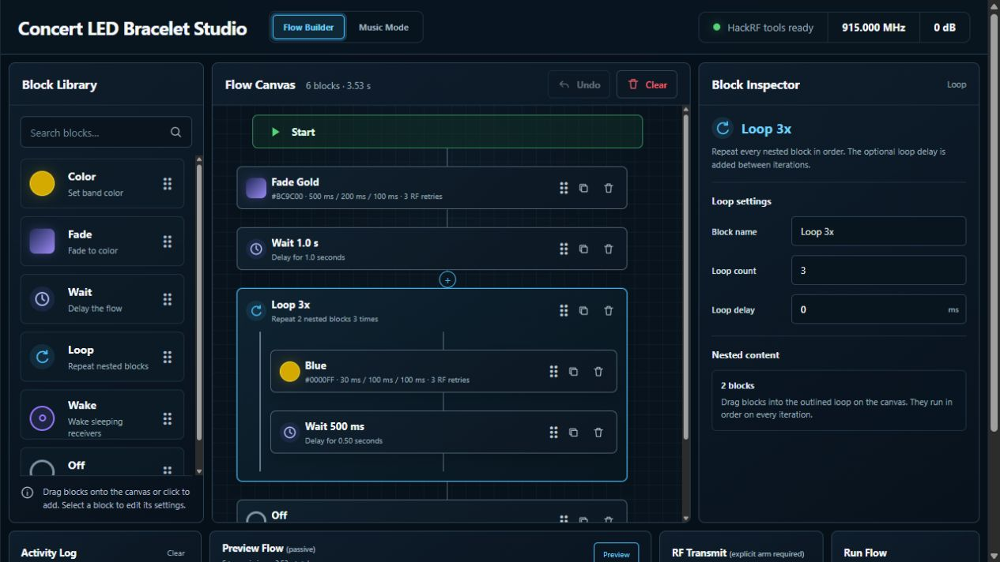
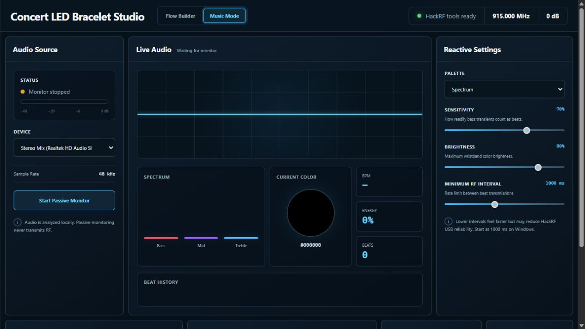
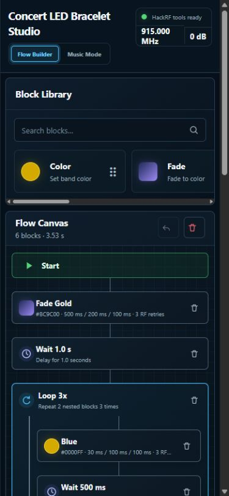

# Concert LED Bracelet Studio

Concert LED Bracelet Studio is a local control and analysis workspace for
compatible RF concert bracelets. It converts Flipper Zero Sub-GHz RAW captures
into the signed 8-bit complex IQ format consumed by `hackrf_transfer`, and it
recognizes and CRC-checks the publicly documented PixMob CEMENT V1.1 Waveband
frame.

This is an independent interoperability and research project. It is not
affiliated with or endorsed by PixMob; product and company names belong to
their respective owners.

It does **not** assume that a wristband labeled W2 Gen3 uses that protocol.
Conversion and inspection are offline. Transmission is a dry run unless the
operator supplies `--yes-transmit`; TX VGA gain defaults to 0 dB, the HackRF RF
amplifier stays disabled, and antenna-port power stays disabled.

## Current result

- Flipper `RAW_Data` parsing, including multiple lines
- Timing-preserving OOK `.cs8` generation at selectable sample rates
- Repeat count, repeat duration, and carrier-off inter-packet gaps
- Advisory 90-symbol CEMENT V1.1 decode, 6b8b decode, and CRC-12 validation
- Generated RGB/effect commands, named presets, wake/off, and interactive control
- Local Concert LED Bracelet Studio browser UI with a drag-and-drop Flow Builder and reactive Music Mode
- Automatic transmission through a temporary `.cs8` file (cleaned up after use)
- Passive, bounded HackRF capture command
- Unit tests against three captures from the primary reverse-engineering repo

IQ envelope extraction and capture-to-`.sub` reconstruction are planned next;
see [the implementation plan](docs/IMPLEMENTATION_PLAN.md).

## Interface

These views were captured from the current local application with RF transmit
locked and passive monitoring stopped.

### Flow Builder



### Music Mode



### Mobile Flow Builder



## Install

Python 3.10 or newer is sufficient for conversion and inspection. Music Mode
adds NumPy and PortAudio bindings through the optional `music` extra.

### Windows

```powershell
py -m venv .venv
.\.venv\Scripts\Activate.ps1
python -m pip install -e ".[music]"
hackrf_info
```

If `hackrf_transfer.exe` is not on `PATH`, pass its full path with
`--hackrf-transfer C:\HackRF\bin\hackrf_transfer.exe`.

### Linux

Install Python and the distribution's HackRF tools, then:

```bash
python3 -m venv .venv
source .venv/bin/activate
python -m pip install -e ".[music]"
hackrf_info
```

Linux USB access may require the HackRF udev rules supplied by the HackRF
package. Do not run the utility as root merely to bypass missing rules.

## Inspect before converting

```powershell
python concert_led_bracelet_studio.py inspect commands\gold_fade_in_915.sub
```

For the included gold capture this reports 59 signed runs, 45.9 ms total, nine
on-air bytes, seven decoded logical values, and a valid CRC-12.

## Convert `.sub` to `.cs8`

```powershell
python concert_led_bracelet_studio.py convert commands\gold_fade_in_915.sub gold.cs8
```

At the default 2 MHz sample rate, each 510 us symbol is exactly 1,020 complex
samples. The known 45.9 ms gold capture therefore becomes 91,800 complex
samples, or 183,600 bytes.

Useful options:

```powershell
python concert_led_bracelet_studio.py convert input.sub output.cs8 `
  --sample-rate 2M `
  --amplitude 64 `
  --repeat-count 10 `
  --inter-packet-delay-us 4080
```

Use `--repeat-duration 20` instead of `--repeat-count` to emit only complete
packets until at least 20 seconds is covered. `--force` is required to replace
an existing output.

The `.cs8` stream is interleaved signed int8 `(I,Q)`:

- carrier ON: `(amplitude, 0)`
- carrier OFF: `(0, 0)`

Frequency and sample-rate metadata are not embedded in raw `.cs8`; retain them
in the filename or capture notes. The converter rounds cumulative transition
boundaries rather than each pulse independently, preventing accumulated timing
drift at sample rates where a microsecond is a fractional number of samples.

`hackrf_transfer` accepts 2–20 MHz. Two MHz is convenient and exactly represents
the public 500/510 us timings. HackRF's own guidance says 8–20 MHz is the optimal
ADC/DAC range, so retry at 8 MHz if a 2 MHz hardware replay is unreliable.

## Control software

### Concert LED Bracelet Studio browser UI

Launch the visual flow builder in preview-only mode:

```powershell
python concert_led_bracelet_studio_ui.py --frequency 915M
```

The local page opens at `http://127.0.0.1:8765/`. It includes:

- draggable Color, Fade, Wait, Loop, Wake, and Off blocks
- nested loops with a loop count and optional delay between iterations
- per-block RGB, mode, attack, hold, release, randomness, group, and RF retries
- a passive full-flow timeline with expanded action count and duration
- Undo, duplicate, delete, drag-to-reorder, and local flow persistence
- an event log and explicitly separated RF arm/run controls

`RF retries` repeats the same command packet to improve reception. It does not
mean visual effect loops. Use a Loop block containing one or more command and
Wait blocks when the visible sequence should repeat.

Preview-only mode cannot transmit. To create a transmit-capable session, stop
the server and relaunch it with the explicit server gate:

```powershell
python concert_led_bracelet_studio_ui.py `
  --frequency 915M `
  --tx-gain 0 `
  --allow-transmit
```

If the HackRF tools are not on `PATH`, add:

```powershell
--hackrf-transfer C:\HackRF\bin\hackrf_transfer.exe
```

Even in a transmit-capable session, RF remains locked until **Arm RF transmit**
is switched on and **Run Flow** is clicked. Once armed, it stays armed
until the switch is turned off, allowing repeated commands without rearming.
The server listens only on local loopback and requires a random same-session
token for every preview/transmit request.
TX VGA gain defaults to the server's `--tx-gain` value and can be adjusted from
0–47 dB with the UI slider before a run. The RF amplifier and antenna power
remain off.

The installed entry point is equivalent:

```powershell
concert-led-bracelet-studio --frequency 915M --tx-gain 0 --allow-transmit
```

### Music Mode (Spotify and other local audio)

Open the **Music Mode** tab in Concert LED Bracelet Studio to react to any audio playing on
the computer. It analyzes a Windows/Linux audio input locally; it does not need
a Spotify login or Spotify API access.

On Windows, choose **Stereo Mix (Realtek HD Audio Stereo input)** when it is
available. Start Spotify or another player, then:

1. Click **Start Passive Monitor** and confirm the waveform/energy meter reacts.
2. Adjust Palette, Sensitivity, Brightness, and Minimum RF Interval. Stop the
   passive monitor first to change analysis settings.
3. Keep TX gain low (0 dB is the default), switch on **Arm RF transmit**, then
   click **Start Music Sync**.
4. Click **Stop Music Sync** when finished. Stopping also disarms RF.

Passive monitoring never transmits. Music sync sends a short one-shot color
command only on detected bass transients and rate-limits commands with Minimum
RF Interval; 1000 ms is the recommended Windows starting point for HackRF USB
reliability. If the meter stays at zero, ensure music is actively playing and
select a loopback/monitor source rather than a microphone. Linux users may need
to expose a PulseAudio/PipeWire monitor input before it appears in the list.

Music Sync performs a passive `hackrf_info` presence check before it switches
from monitoring to RF. If the HackRF USB connection drops, beat transmission
automatically retries transient WinUSB open/pipe failures twice with short
settle delays. If all retries fail, beat transmission stops but the audio
monitor remains active. Reconnect the HackRF and click **Start Music Sync**
again; the existing RF arm stays set for that retry.

### Terminal controller

List the available targets:

```powershell
python concert_led_bracelet_studio.py presets
```

Generate and preview a control command without transmitting:

```powershell
python concert_led_bracelet_studio.py control red --frequency 915M --tx-gain 0
python concert_led_bracelet_studio.py control fade-gold --frequency 915M --tx-gain 0
python concert_led_bracelet_studio.py control '#0080FF' --frequency 915M --tx-gain 0
```

`fade-gold` generates exactly the same signed pulse sequence as the included
CRC-valid `gold_fade_in_915.sub` capture. Other colors are generated from their
RGB values, encoded with the documented 6b8b table, and assigned a calculated
CRC-12.

After reviewing the displayed frame and RF plan, add `--yes-transmit`:

```powershell
python concert_led_bracelet_studio.py control red `
  --frequency 915M `
  --tx-gain 0 `
  --yes-transmit
```

Open the interactive terminal controller with:

```powershell
python concert_led_bracelet_studio.py control `
  --frequency 915M `
  --tx-gain 0 `
  --yes-transmit
```

At `pixmob>` enter `red`, `blue`, `white`, `fade-gold`, `#RRGGBB`,
`R,G,B`, `rgb R G B`, `wake 20`, `off`, `list`, or `quit`. Authorization applies
to that interactive session, so every color entered will transmit until the
session is closed.

The normal effect burst is approximately 0.6 seconds with an approximately
80 ms packet period. Override it with `--transmit-duration` or `--repeat-count`.
The effect fields accept indices 0–7:

- attack: 0, 30, 100, 200, 500, 1000, 2000, 4000 ms
- hold: 0, 30, 100, 200, 500, 1000, 2500 ms, infinite
- release: background, 30, 100, 200, 500, 1000, 2000, 4000 ms
- random: 0, 10, 20, 35, 50, 65, 80, 95 percent

For example:

```powershell
python concert_led_bracelet_studio.py control '#FF4000' `
  --frequency 915M `
  --attack 4 `
  --hold 3 `
  --release 2 `
  --random 0 `
  --group 0
```

Wake/keepalive uses the upstream `nothing` payload and defaults to 20 seconds:

```powershell
python concert_led_bracelet_studio.py control wake --frequency 915M --tx-gain 0
```

This is also a dry run until `--yes-transmit` is present. Continuous and
one-shot modes are available through `--mode`. `--mode forever` is deliberately
blocked unless `--allow-persistent` is also provided because the decoded
firmware behavior may persist across a battery cycle.

## Transmission safety and automatic temporary files

The following command is a **dry run**. It does not key the HackRF:

```powershell
python concert_led_bracelet_studio.py transmit commands\gold_fade_in_915.sub `
  --frequency 915M `
  --tx-gain 0
```

It prints the input frequency metadata, intentional RF frequency, duration,
repeat count, digital amplitude, gain state, and the representative
`hackrf_transfer` invocation. During transmission the utility generates a
temporary `.cs8` file, passes its real path to `hackrf_transfer`, and removes
it afterward. Actual transmission additionally requires `--yes-transmit`:

```powershell
python concert_led_bracelet_studio.py transmit commands\gold_fade_in_915.sub `
  --frequency 915M `
  --sample-rate 2M `
  --tx-gain 0 `
  --yes-transmit
```

Only do this after identifying the wristband variant and checking local radio
rules. Start with the HackRF and your own wristband centimeters apart, a band-
appropriate antenna or attenuated/near-field setup, digital amplitude 32–64,
TX gain 0, and the shortest useful burst. Never test at an event or around
devices you do not own. The utility never enables the HackRF RF amplifier.

The public Waveband notes describe repeated valid packets as a wake mechanism.
An observed approximately 4.08 ms carrier-off gap is a useful experiment, not
a confirmed universal requirement:

```powershell
python concert_led_bracelet_studio.py transmit commands\nothing_915.sub `
  --frequency 915M `
  --repeat-duration 20 `
  --inter-packet-delay-us 4080 `
  --tx-gain 0
```

That remains a dry run until `--yes-transmit` is added.

## Passive receive workflow

With access to an original controller, make separate captures around the EU
and US candidates. An 8 MHz capture centered at 868.4 MHz covers both 868.0 and
868.4 MHz; the corresponding US capture centered at 915.33 MHz covers both
915.0 and 915.33 MHz.

Preview a passive command:

```powershell
python concert_led_bracelet_studio.py capture captures\controller_915.cs8 `
  --frequency 915.33M `
  --sample-rate 8M `
  --duration 10 `
  --dry-run
```

Remove `--dry-run` to record. The default RX LNA and VGA gains are each 16 dB,
the RF amplifier is disabled, and the capture has an explicit sample count.
Use `--force` only when an existing recording is intentionally replaceable.

For a controller with a very strong nearby signal, start with lower RX gains to
avoid clipping. Record a quiet baseline with the controller idle, then several
isolated button presses or cues. Note center frequency, sample rate, gains,
distance, controller identity, and cue observation alongside every recording.

## How certain is W2 Gen3 compatibility?

Not certain from the label alone. PixMob's current product material explicitly
distinguishes the two-LED **X2 (infrared)** from **Waveband 2 (RF)**, while the
public hardware table ties the decoded RF protocol to a PCB labeled CEMENT
V1.1. No primary source found maps the exact label “W2 Gen3” to CEMENT V1.1,
868 MHz, 915 MHz, or a particular frame revision.

The strongest identification paths are:

1. PCB inspection: `CEMENT V1.1`, a CMT2210LH receiver, and the documented
   crystal/antenna layout are strong evidence for this Waveband implementation.
2. Original-controller capture: directly establishes frequency, modulation,
   timing, and packet similarity without transmitting.
3. Controlled replay to the owned wristband: confirms compatibility but should
   follow passive/visual identification and local spectrum checks.
4. Event region or a “W2” name: useful clues only, not confirmation.

An obvious IR receiver establishes an IR-capable design, but it does not by
itself prove the older 38 kHz PixMob protocol. Detailed evidence and the
500-versus-510 us / frequency discrepancies are in
[the protocol notes](docs/PROTOCOL_NOTES.md).

## Tests

```powershell
python -m unittest discover -s tests -v
```

The tests verify parsing, multi-line RAW data, strict/permissive handling,
cumulative sample quantization, repeat scheduling, safe HackRF command flags,
known file sizes and edges, 90-symbol framing, 6b8b decoding, CRC-12, and
encode/decode round trips. They also prove that generated `fade-gold` and
`keepalive` pulses exactly equal the upstream captures and that arbitrary-color
controller commands have valid CRCs. No test transmits RF.

The former `pixmob-hackrf`, `pixmob-hackrf-ui`, `pixmob_hackrf.py`, and
`pixmob_ui.py` names remain available as compatibility aliases.

## Sources

- [Dani Weidman's PixMob reverse-engineering repository](https://github.com/danielweidman/pixmob-ir-reverse-engineering/tree/b372420e1e1ff818a8d25ba50f0c71e97e62f138/rf)
- [sueppchen's CEMENT V1.1 Waveband implementation](https://github.com/sueppchen/PixMob_waveband/tree/82f370d6db40da070f9b525e7914d0498a3fd638)
- [CEMENT V1.1 transmission wiki](https://github.com/sueppchen/PixMob_waveband/wiki/transmission)
- [Official Flipper Sub-GHz file-format documentation](https://github.com/flipperdevices/flipperzero-firmware/blob/dev/documentation/file_formats/SubGhzFileFormats.md)
- [Official HackRF tools documentation](https://hackrf.readthedocs.io/en/latest/hackrf_tools.html)
- [PixMob Waveband product page](https://www.pixmob.com/products/led-wristbands/waveband)
- [PixMob wristband comparison](https://www.pixmob.com/products/led-wristbands)

## License and attribution

This project is licensed under the [MIT License](LICENSE). Reuse,
modification, and redistribution are welcome as long as the copyright and
license notice are retained. Please credit **acamporat / Concert LED Bracelet
Studio**. The included upstream command fixtures have their own required
attribution in [THIRD_PARTY_NOTICES.md](THIRD_PARTY_NOTICES.md).
